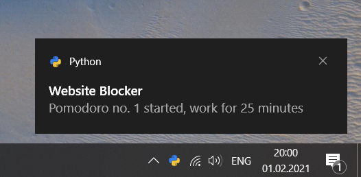

# Be Productive
> A tool that let's you focus on your work by blocking distracting websites. Optionally with a timer for work sessions, using the Pomodoro technique.


## Install

To install **Be Productive**:
```pip install beproductive```

If you use Windows, it's recommended to `pip install win10toast` for [nice Windows notifications](https://github.com/jithurjacob/Windows-10-Toast-Notifications). 



You don't have to install `win10toast`, but without it you will not get visible and audible notifications for Pomodoro. However, all notifications are also printed in your command line interface.

## Blocked Websites

These websites are blocked per default, but you can always edit `blocklist.py` and add your personal time killers.

```python
print("\n".join(BLOCKLIST))
```

    twitter.com
    youtube.com
    facebook.com
    instagram.com
    reddit.com
    netflix.com
    amazon.com
    linkedin.com


## How to Use

### Windows
You have to open your command line tool with **administrator privileges.**

### Linux (and MacOS?)
You have to run Be Productive with **root privileges**, either with `sudo` before every command or once with `su`.

### Block / Unblock Websites
Block websites:
```
python -m beproductive
```
Block websites for `x` minutes:
```
python -m beproductive block 45
```
Unblock all websites:
```
python -m beproductive unblock
```

Start a Pomodoro session:
```
python -m beproductive pomodoro
```

### Pomodoro
The [Pomodoro](https://en.wikipedia.org/wiki/Pomodoro_Technique) feature blocks your defined websites for 25 minutes. It notifies you after the 25 minutes are over and gives you access to all websites for 5 minutes. Although I recommend getting up and stretching instead :) This cycle is repeated 4 times.

You can set custom times. This is how you run 5 Pomodoros of 45 minutes with 10 minute breaks:
```
python -m beproductive pomodoro 45 10 5
```

### Batch files
For quick access:
1. Create batch files for the commands you need.
2. Add a shortcut to each batch file to your desktop.
3. Right click on the shortcut
4. In the `Shortcut` tab, click `Advanced`
5. Check the `Run as Administrator` box
6. You can even add a key binding.

I used:
- Ctrl + Alt + **B** to block all sites for 1 hour
- Ctrl + Alt + **U** to unblock all sites
- Ctrl + Alt + **P** to run a Pomodoro set

Example for a batch file `block.bat`:
```python -m beproductive block 60```

## Behind the Scenes
The script blocks URLs by modifying the `hosts` file. Blocked URLs are redirected to `127.0.0.1`. The script backs up the original `hosts` file. You will not lose any customizations and you can always reset to the original state.

## Roadmap
- Make customizing the blocklist easy
- Set up a schedule, i.e., block websites between 9am and 5pm
